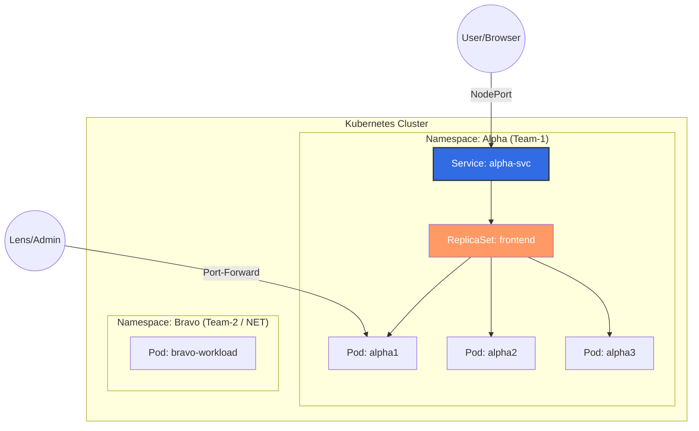

# 🚀 Kubernetes Mastery: Core Fundamentals

[](https://kubernetes.io/)
[](https://www.docker.com/)
[](https://yaml.org/)
[](https://www.gnu.org/software/bash/)
[](https://aws.amazon.com/)
[](https://kops.sigs.k8s.io/)


Welcome to this session of my Kubernetes journey! This module bridges the gap between running simple containers and managing production-ready, self-healing workloads.

---

## 🎯 Learning Objectives

In this hands-on session, we dive deep into the following:
*   🏗️ **Namespaces**: Understanding multi-tenancy and logical isolation (Team Alpha vs Team Bravo).
*   📦 **Pods**: Moving beyond Docker—understanding Pods as wrapper units.
*   🔄 **ReplicaSets**: Mastering self-healing and the power of Labels.
*   🌐 **Services**: Implementing stable networking, Endpoints, and NodePort exposure.
*   🛠️ **DevOps Tooling**: Setting up **Lens** and **kubens** for efficient cluster management.

---

## 🏛️ Infrastructure Architecture

Below is a visual representation of the logical isolation and workload distribution we implemented today:



> [!NOTE]
> **Isolation & Communication:** Namespaces provide logical isolation between Team-1 and Team-2. However, communication can still be established by configuring **Network Policies**.

---

## 1️⃣ Pods: Beyond Docker Containers

In Docker, we run containers directly:
```bash
docker run -it -d --name app1 -p 8000:80 nginx:latest
```

In **Kubernetes**, we deploy **Pods**. 
*   **What is a Pod?** It's a wrapper containing one or more containers (e.g., App + Sidecar).
*   **Storage:** Pods share a default temporary space called `emptyDir`.

### Commands for Pod Management:
```bash
# Basic listing
kubectl get pods
kubectl get pods -o wide

# Explore object schema
kubectl api-resources --namespaced=true
kubectl explain pod.metadata
```

---

## 2️⃣ ReplicaSets: The Self-Healing Mechanism

### Observation: Pod vs ReplicaSet
We compared a standalone Pod (`alpha1`) with a Pod managed by a **ReplicaSet**.

1.  **Deletion Test (Standalone):** When we deleted the standalone pod `alpha1`, it was gone forever. It did **not** come back.
2.  **Deletion Test (ReplicaSet):** We deleted a pod created by the RS (`frontend-nd2nn`).
    *   **Result:** A new pod was created **instantly**.
    
**Key Concept:** ReplicaSets use **Labels** behind the scenes to monitor the "Desired State" vs "Current State".

### ReplicaSet Manifest (`rs.yml`)
```yaml
apiVersion: apps/v1
kind: ReplicaSet
metadata:
  name: frontend
spec:
  replicas: 3
  selector:
    matchLabels:
      tier: frontend
  template:
    metadata:
      labels:
        tier: frontend
    spec:
      containers:
        - name: kubegame
          image: rayeez/kubegame:v1
```

---

## 3️⃣ Services & Networking

### How Services Connect to Pods
When we run `kubectl describe svc alpha1`, we see an **Endpoint** (e.g., `10.0.4.148:80`). This IP belongs to the Pod.
> **Why?** Services use **Labels & Selectors** to dynamically track and connect to Pods.

### Exposing the App to the World
```bash
# Step 1: Expose the pod
kubectl expose pod alpha1 --port 8000 --target-port 80 --type NodePort

# Step 2: Get the assigned port
kubectl get svc -o wide
```

**Accessing via Browser:**
Use the **Public DNS** of any EC2 Worker Node + the NodePort:
`http://<ec2-public-dns>:31275`

---

## 4️⃣ Cluster Access & Productivity Tools

### 🌐 Lens Integration
We exported our cluster configuration to **Lens** on a Windows machine to manage the cluster visually.
1.  Copy content of `~/.kube/config`.
2.  Paste into Lens (Add Cluster).
3.  **Port-Forwarding via Lens Terminal:**
    ```bash
    kubectl -n alpha port-forward pod/alpha1 8000:80
    ```
    Now, the app is accessible at `localhost:8000`.

### ⚡ kubens (Namespace Switching)
Instead of typing `-n alpha` every time, we installed `kubens`:

```bash
cd /usr/local/bin
wget https://github.com/ahmetb/kubectx/releases/download/v0.9.5/kubens_v0.9.5_linux_x86_64.tar.gz
tar zxvf kubens_v0.9.5_linux_x86_64.tar.gz

# Usage:
kubens          # List namespaces
kubens alpha    # Switch context to 'alpha'
```

---

## 📄 Multi-Pod Declarative Deployment
We can deploy multiple pods inline using heredocs:

```bash
echo '
apiVersion: v1
kind: Pod
metadata:
  name: alpha2
  namespace: alpha
spec:
  containers:
    - image: rayeez/kubegame:v1
      name: alpha2
---
apiVersion: v1
kind: Pod
metadata:
  name: alpha3
  namespace: alpha
spec:
  containers:
    - image: rayeez/kubegame:v1
      name: alpha3
' | kubectl apply -f -
```

---

## 🛠️ Commands Quick Reference

| Action | Command |
| :--- | :--- |
| **Namespace** | `kubectl create ns alpha` |
| **Explain Schema** | `kubectl explain pod.spec.affinity` |
| **Labels Connect** | `kubectl describe svc <name>` (Check Endpoints) |
| **Port Forward** | `kubectl port-forward <pod> 8000:80` |
| **Switch NS** | `kubens <namespace>` |
| **Delete Pods** | `kubectl delete pod alpha3 alpha2` |
| **Config Check** | `cat ~/.kube/config` |

---

## 🏁 Conclusion
This session highlighted the core "Desirable State" philosophy of Kubernetes. We moved from ephemeral Pods to stable **Services** and self-healing **ReplicaSets**, all while leveraging professional tools like **Lens** and **kubens** to streamline our DevOps workflow.
